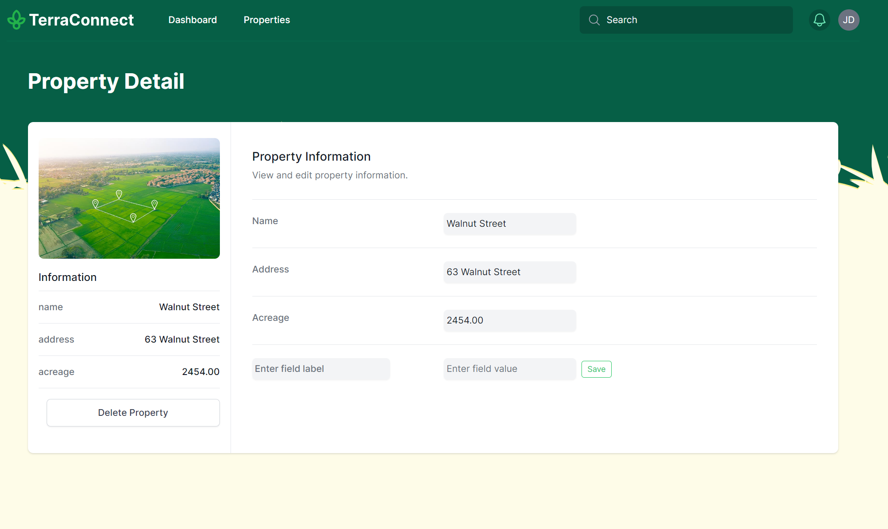

# TerraConnect

TerraConnect is a full-stack land management application powered by Django, Django Rest Framework (DRF), and Next.js. It employs Tailwind CSS and Tailwind UI for stylish and responsive UI/UX. Docker and Docker Compose are used for easy setup and deployment.




## Table of Contents

1.  [Features](#features)
2.  [Installation](#installation)
3.  [Usage](#usage)
4.  [Contributing](#contributing)
5.  [Support](#support)
6.  [License](#license)

## Features

- Comprehensive land management tools
- Sleek, modern UI built with Tailwind CSS and Tailwind UI
- Backend powered by Django and Django Rest Framework (DRF)
- Next.js frontend for optimized user interface
- Easy setup and deployment with Docker

## Installation

Make sure Docker and Docker Compose are installed on your machine. Then, follow these steps:

1.  Clone the repository:

    bash

    ```bash
    git clone https://github.com/haybarcheezy/TerraConnect.git
    cd TerraConnect
    ```

2.  Build and run the Docker services:

    bash

    ```bash
    docker-compose up -d
    ```

3.  After the services are up, create the necessary database migrations:

    bash

    ```bash
    docker-compose exec web python manage.py makemigrations
    docker-compose exec web python manage.py migrate
    ```

For the frontend:

1.  Navigate to the frontend directory:

    bash

    ```bash
    cd frontend
    ```

2.  Install all dependencies:

    bash

    ```bash
    npm install
    ```

## Usage

Once everything is set up:

- Start the backend server with Docker Compose:

  bash

  ```bash
  docker-compose up -d
  ```

- Start the frontend development server:

  bash

  ```bash
  cd frontend
  npm run dev
  ```

Now, you can navigate to `http://localhost:3000` (or the port you've configured) in your browser to start using TerraConnect.

## Contributing

We welcome contributions! Please see our [Contributing Guidelines](CONTRIBUTING.md) for more details.

## Support

If you encounter any issues or have questions, please file an issue in our [GitHub issue tracker](https://github.com/%3haybarcheezy%3E/TerraConnect/issues).

## License

TerraConnect is open source and [MIT licensed](LICENSE).
